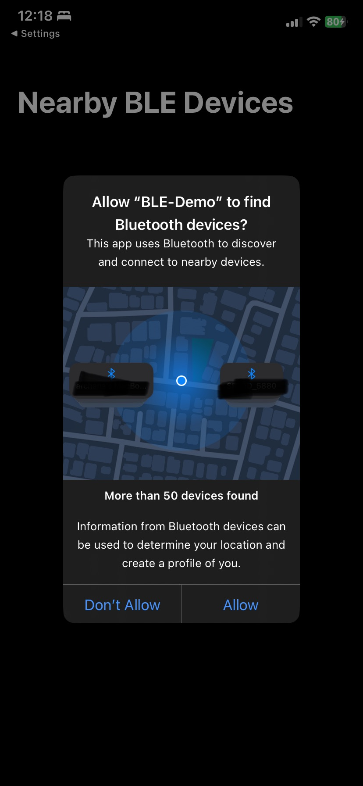
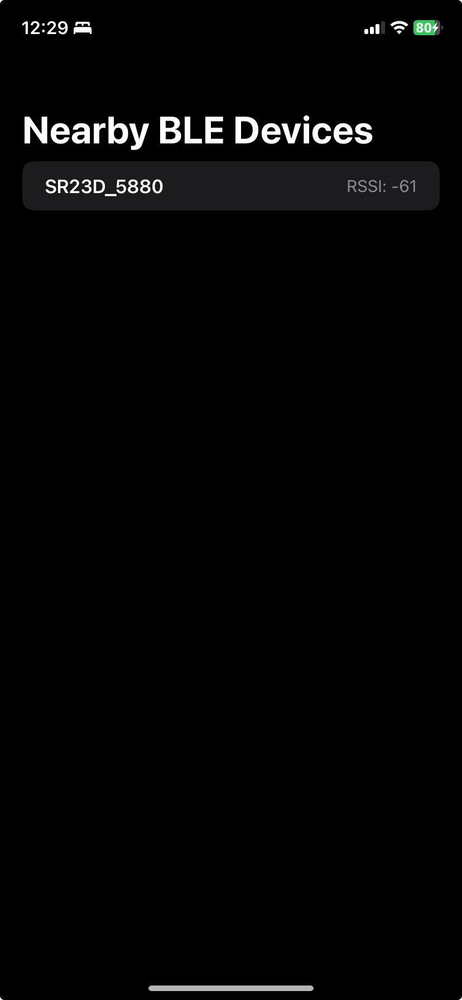

# BLE Demo (SwiftUI)
A simple Bluetooth Low Energy (BLE) scanner built with SwiftUI and CoreBluetooth.

## Features
- Scans for nearby BLE devices
- Displays name and signal strength (RSSI)
- Built using MVVM architecture

## Tech Stack
- SwiftUI
- CoreBluetooth
- Combine

## Screenshots

### Home Screen

### Device List

## Author
Archana Racha – Senior iOS Engineer  
[linkedin.com/in/archana-r-5600aa53](https://linkedin.com/in/archana-r-5600aa53)

